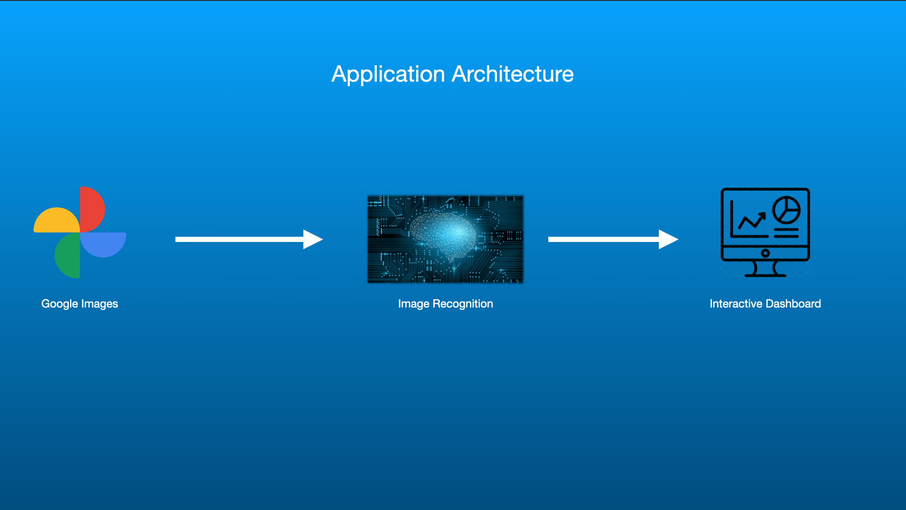

# Postural Analysis

## Goal:

Based on an image of your posture, this application will suggest relevant muscle groups to target treatment on.

## Problem:

Massage Therapists targeting the right muscle groups to work.

Possible gaps in knowledge when it comes to assessment.

## Why this is important:

It is important to focus your work on the right muscle groups so the client can experience maximum pain relief

## Collect:

Scrape Google images for data

### Tools:

selenium (third pary library)

urllib (python built-in library)

## Clean:

1. Slice images in half (because images are: normal vs. bad posture)

2. Add padding and resize images

3. Hand select images to use (can we automate this?)

4. Mirror and scale images so model has more relevant data to learn from

5. Normalization/Edge detection

### Tools:

OpenCV (third pary library)

## Data Pipeline:

1. Scrape google images for relevant image urls
2. Download the image urls
3. Filter out the data
4. Store it
5. Do machine learning
6. Start feeding it images and seeing results
